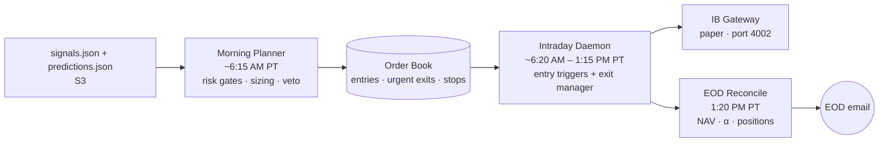

# alpha-engine (executor)

> Part of [**Nous Ergon**](https://nousergon.ai) — Autonomous Multi-Agent Trading System. Repo and S3 names use the underlying project name `alpha-engine`.

Risk-gated trade executor. Reads research signals + predictor verdicts from S3, applies hard risk rules, sizes positions, and routes orders through IB Gateway. The morning planner writes the order book; an intraday daemon is the sole order executor.

> System overview, Step Function orchestration, and module relationships live in [`alpha-engine-docs`](https://github.com/cipher813/alpha-engine-docs). Code index lives in [`OVERVIEW.md`](OVERVIEW.md).

## What this does

- **Risk-gated position sizing** — equal-weight base × sector rating × conviction × price-target upside × graduated drawdown tier; hard caps on max position, max sector exposure, max total equity. EXIT and REDUCE bypass all gates.
- **Predictor veto integration** — high-confidence DOWN predictions override BUY signals before they reach the order book.
- **Intraday entry triggers** — pullback / VWAP discount / support bounce / 3:30 PM ET time-expiry. Daemon waits for a trigger to fire rather than crossing the spread at market open.
- **Strategy layer** (backtestable) — ATR trailing stops + time-based exit decay + graduated drawdown response (tiered sizing reduction → circuit-breaker halt).
- **EOD reconciliation** — captures NAV, computes daily return vs SPY, persists to SQLite, sends EOD email.

## Phase 2 measurement contribution

Every fill, sizing decision, and risk-guard override is logged to SQLite + backed up to S3. Daily P&L is attributed in `eod_pnl.csv` with breakdowns for portfolio return, SPY benchmark, alpha, total cash, accrued interest, and unrealized vs realized P&L. The sizing path captures the input ladder (sector rating × conviction × upside × drawdown tier) at decision time so any position can be replayed against a different parameter set.

## Architecture

The daemon is the sole order executor — main.py never places orders, only writes the book. Urgent exits run immediately at market open; entries wait for technical triggers or the 3:30 PM ET time expiry.

## Configuration

This repo is **public**. `config/risk.yaml` is gitignored locally; real risk thresholds, sizing parameters, and IB credentials live in the private [`alpha-engine-config`](https://github.com/cipher813/alpha-engine-config) repo. Tunable safe-to-tune params auto-applied weekly by the Backtester via `s3://alpha-engine-research/config/executor_params.json`. Architecture and approach are public; specific values are private.

## Sister repos

| Module | Repo |
|---|---|
| Data | [`alpha-engine-data`](https://github.com/cipher813/alpha-engine-data) |
| Research | [`alpha-engine-research`](https://github.com/cipher813/alpha-engine-research) |
| Predictor | [`alpha-engine-predictor`](https://github.com/cipher813/alpha-engine-predictor) |
| Backtester | [`alpha-engine-backtester`](https://github.com/cipher813/alpha-engine-backtester) |
| Dashboard | [`alpha-engine-dashboard`](https://github.com/cipher813/alpha-engine-dashboard) |
| Library | [`alpha-engine-lib`](https://github.com/cipher813/alpha-engine-lib) |
| Docs | [`alpha-engine-docs`](https://github.com/cipher813/alpha-engine-docs) |

## License

MIT — see [LICENSE](LICENSE).
